# Building TradePlan_SPX: An Adaptive Intraday Forecasting Framework for the S&P 500

### A beginner ML researcher’s roadmap from market data to a live Trade Plan

I did not start this project as a professional trader.

I also do not present myself as a market expert or an experienced quantitative researcher. My starting point was much simpler: I had a background in algorithms, data analysis, automation, and machine learning, and I wanted to understand whether those skills could help transform intraday trading from an emotional process into a more structured decision-making system.

Trading interested me as one possible way to diversify income. But I quickly realized that a trading tool is useful only if it helps make better, more disciplined, and economically meaningful decisions.

That is how the idea for **TradePlan_SPX** appeared.

I wanted to build a framework that could act as a roadmap for someone like me: a beginner in trading, but not a beginner in algorithms.

The goal was never to create a magical model that predicts every SPX movement perfectly. That would be unrealistic. The goal was more practical:
- study recurring intraday SPX behavior,
- formalize observations into measurable features,
- build linked models around different market metrics,
- and generate a structured Trade Plan that helps a trader understand the session instead of reacting randomly.

At the time of writing, the project is still young. The historical database contains **120 processed SPX sessions**. From a machine learning perspective, that is a small dataset. It would be incorrect to treat the current backtest as a final verdict on the system.

But the important point is this: even with a limited dataset, the framework has already started producing meaningful structure. It recognizes regimes, builds useful scenario ranges, identifies chop-heavy sessions, and generates Trade Plans that can support real intraday decisions.

For me, that was the first serious milestone. It showed that the idea is not empty.

Now the project can move from proof-of-concept into optimization.

**List of Figures**

| Fig. | Chart | Section |
|------|-------|---------|
| 1 | Production pipeline diagram | System Architecture |
| 2 | VIX rank confusion matrix | Session Opening Forecast Engine |
| 3 | Bias direction validation | Quantitative Validation |
| 4 | Bias model — feature importance | Directional Bias Forecasting |
| 5 | Bias strength vs realized move | Directional Bias Forecasting |
| 6 | Chop model — feature importance | Chop Regime Modeling |
| 7 | Regime map — predicted chop vs realized range | Chop Regime Modeling |
| 8 | Trade Plan — summary panel | Trade Plan Generation |
| 9 | Trade Plan — full workbook layout | Trade Plan Generation |
| 10 | Intraday update — after segment 1 (~11:00) | Intraday Adaptive Recalibration |
| 11 | Intraday update — after segment 2 (~12:30) | Intraday Adaptive Recalibration |
| 12 | Expected Move vs realized range | Quantitative Validation |
| 13 | Chop duration validation | Quantitative Validation |
| 14 | Range & targets vs session bounds | Quantitative Validation |
| 15 | Range bound calibration tiers | Quantitative Validation |
| 16 | Expected Move calibration | Quantitative Validation |
| 17 | Signed prediction error histograms | Quantitative Validation |
| 18 | Regime transition timeline | Quantitative Validation |
| 19 | Target 1–3 reach vs fact_range (last 20 sessions) | Quantitative Validation — Interpretation |

### From Direction Prediction to Market-State Modeling

The first question looked simple:

> Can I forecast the next SPX session before the market opens?

At the beginning, I thought the main problem would be direction: bullish or bearish.

But this assumption became weak very quickly.

Two sessions can both close bullish and still be completely different for a trader:

| Same Closing Direction | Completely Different Trading Environment |
|---|---|
| Bullish close | Clean trend continuation |
| Bullish close | Violent rotational chop |
| Bearish close | Controlled selloff |
| Bearish close | Failed breakdown and reversal |

This was one of the first important insights in the project.

A correct direction is not enough. 
A trader also needs to understand whether the session is likely to trend, rotate, compress, expand, reject a breakout, or remain trapped inside chop.

So the project gradually moved away from a single prediction problem and became a **market-state modeling framework**.

Instead of asking only: 
> Will SPX go up or down?

I started asking:
- Is the session likely to trend or rotate?
- Is premarket structure directional or two-sided?
- Is volatility expanding or compressing?
- Does today resemble historical trend sessions or failed-expansion sessions?
- Which targets are realistic under similar historical conditions?
- How should the plan change after the first part of the session becomes visible?

That shift changed the entire architecture of the project.

## System Architecture

At a high level, TradePlan_SPX behaves as a sequential forecasting pipeline.
<div align="center">
        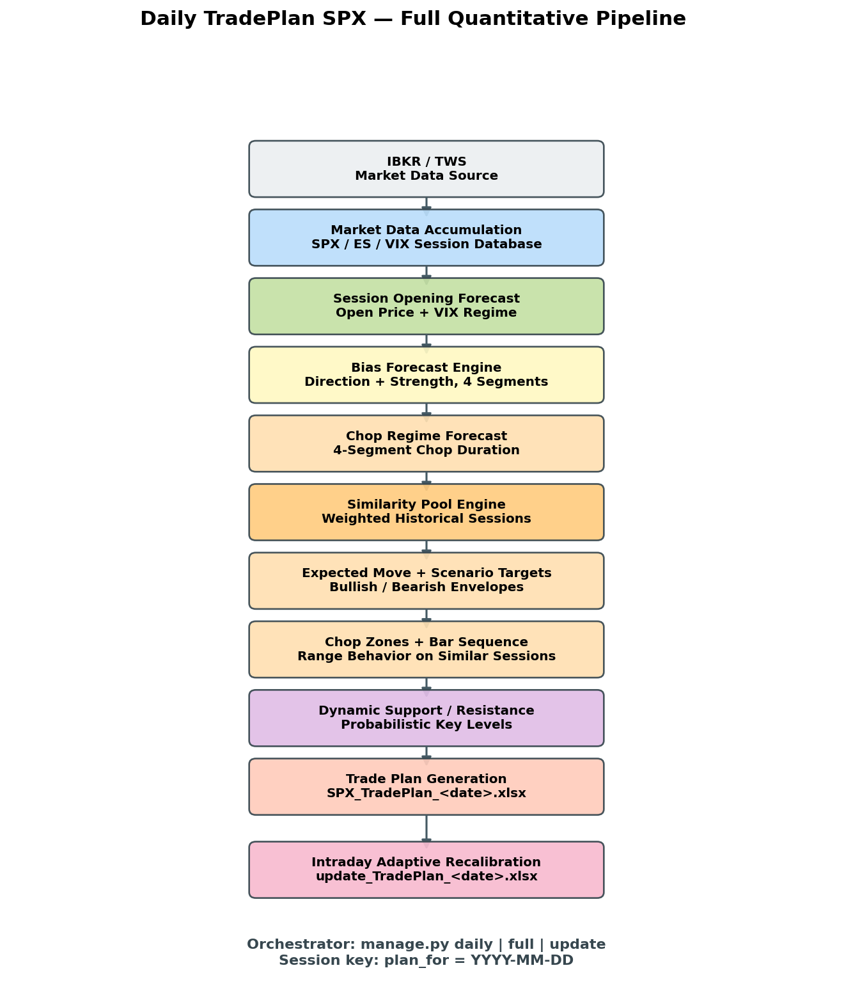
</div>

*Figure 1 — Full production pipeline. Data enters through IBKR (`spx_data_loader.py`), passes through opening, bias, chop, levels, and morning plan assembly (`build_TradePlan.py`), then branches into intraday recalibration (`update_TradePlan.py`). `manage.py` coordinates daily, full, and update modes.*

Each stage produces context for the next one.

For example:
- the opening forecast becomes the first anchor for the day,
- bias forecasts describe directional pressure,
- chop forecasts describe whether continuation may be difficult,
- similarity pools estimate realistic ranges and targets,
- support/resistance zones refine execution context,
- and intraday recalibration replaces assumptions with realized session behavior.

In production, the conceptual pipeline maps directly to Python modules coordinated by `manage.py`:

```text
spx_data_loader.py
      ↓
open_price.py
      ↓
bias.py
      ↓
chop.py           ← chop forecast + similarity pool + scenario metrics
      ↓
levels.py
      ↓
build_TradePlan.py
      ↓
SPX_TradePlan_<date>.xlsx

Intraday branch:
fresh_data_loader.py → update_TradePlan.py → update_TradePlan_<date>.xlsx
```


The morning pipeline and the intraday update pipeline are separated intentionally. The morning workflow builds the first Trade Plan. After the market opens, the update branch rebuilds session state from fresh 1-minute SPX data.

The framework primarily works with:
- SPX,
- ES futures,
- VIX,
- VIX9D,
- and VIX3M.

The architecture is modular because I wanted each part to remain understandable, testable, and replaceable. This matters especially for a young project: the models will evolve, but the system structure should survive those changes.

## Market Data Infrastructure

Before any modeling could work, the project needed reliable historical data.

This part of the system is not the most sophisticated module, but it is essential. It handles the operational layer: collecting, refreshing, checking, and aligning SPX / ES / VIX data.

The loader supports:
- historical downloads,
- incremental refreshes,
- missing-session repair,
- session normalization,
- and multi-timeframe synchronization.

The objective here is simple:

> every forecasting module should receive clean, aligned, reproducible market history.

With a small dataset, every session matters. A missing or corrupted session can distort rolling features, similarity pools, volatility estimates, and backtest results.

So this layer is not intellectually complex, but it protects the integrity of the entire framework.

## Session Opening Forecast Engine

One of the first problems I worked on was the SPX opening forecast.

At first, it looked like a simple gap problem:

> estimate how SPX usually opens relative to the previous close.

But a naive average gap was not useful enough. SPX opening behavior depends on weekday effects, volatility, overnight futures positioning, and recent gap instability.

The final opening engine combines two views of the market:

```text
Historical SPX gap behavior
        +
weekday-adjusted gap statistics
        +
robust dispersion estimates
        ↓
baseline opening estimate

ES premarket structure
        +
fresh ES↔SPX basis
        ↓
ES-implied opening estimate

baseline + futures structure
        ↓
final SPX open prediction
```

The historical branch uses median-based gap behavior and MAD-based robust dispersion instead of naive averages. This reduces the influence of rare extreme overnight gaps.

The ES branch asks a different question:

> If futures are already trading before the cash session, what SPX level do they imply?

To answer that, the model evaluates ES overnight momentum, EMA structure, directional efficiency, and the fresh ES↔SPX basis.

The final prediction is a controlled blend between historical SPX behavior and live futures structure.

### Volatility-aware opening context

Before the cash open, the engine also reads premarket VIX structure and assigns a volatility rank: low, normal, high, or extreme.

<div align="center">
        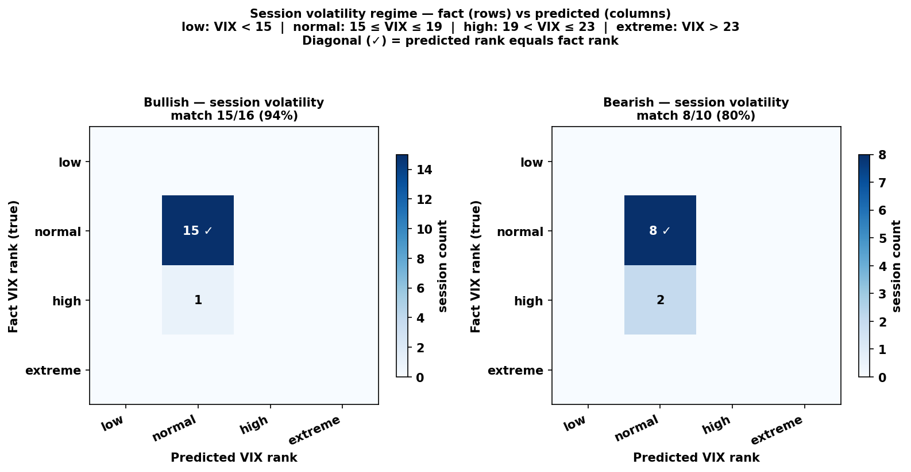
</div>

*Figure 2 — VIX rank validation. Rows show realized session VIX rank; columns show the rank predicted premarket. A stronger diagonal means the opening engine classified the volatility environment more accurately before RTH.*

The opening forecast becomes the first structural anchor for the rest of the system: bias, chop, expected range, levels, and final scenarios are all interpreted relative to it.

## Directional Bias Forecasting

The next major problem was directional bias.

My first instinct was to classify sessions as bullish or bearish. But the more I looked at real SPX sessions, the more obvious it became that classification alone was too crude.

Not all bullish sessions are equally bullish.

Some sessions trend cleanly. Others finish slightly higher after hours of rotation. Those two sessions may share the same label, but they are not the same trading environment.

That is why the bias engine became a regression problem.

It predicts:
- directional orientation,
- directional strength,
- and continuation quality.

The model outputs continuous values that can later be translated into practical labels such as:
- Extreme / Strong / Normal / Weak Bullish,
- Range Day,
- Weak / Normal / Strong / Extreme Bearish.

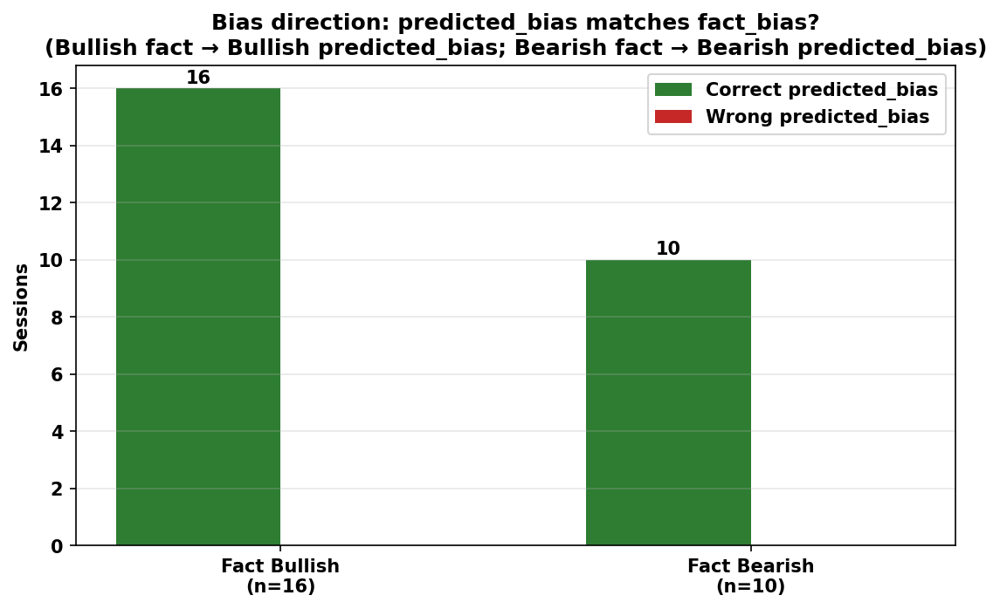 

*Figure 3 — Bias direction validation. Green bars show sessions where predicted bias matched realized fact bias; red bars show mismatches.*

### Target engineering

The first target measures where the session closes relative to its own range:

```text
(Close − Open) / (High − Low)
```

The second target adjusts direction using ATR-normalized movement, path efficiency, and directional persistence.

This distinction became important because direction alone does not tell us whether the move was clean, tradable, and persistent.

### Feature engineering

Most features are expressed as relative changes rather than raw values.

The question is not only:

> What is volatility?

A more useful question is:

> Is volatility behaving unusually compared with recent sessions?

The feature space combines several groups:

| Feature Group | What It Captures |
|---|---|
| SPX microstructure | candle asymmetry, one-sidedness, entropy |
| Recent session behavior | D−1 vs D−2…D−4 regime shifts |
| ES premarket structure | VWAP distance, futures drift, directional efficiency |
| Volatility context | VIX/VIX9D spreads, IV drift |
| Range normalization | ATR-relative imbalance and expansion |

One result surprised me during experimentation: VWAP-related features repeatedly ranked among the strongest predictors.

That made intuitive sense. VWAP is often a central reference point in intraday markets, and the model seemed to confirm that premarket positioning around VWAP contained useful directional information.

<div align="center">
        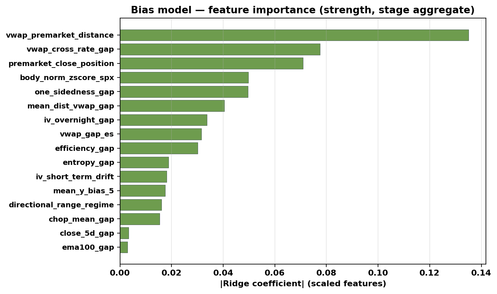
</div>

*Figure 4 — Bias model feature importance. Bar length shows absolute Ridge coefficient size on scaled features after pruning. VWAP distance, IV spreads, and chop-related gaps rank highly, which suggests that the model learns relative market-state dislocations rather than absolute price levels.*


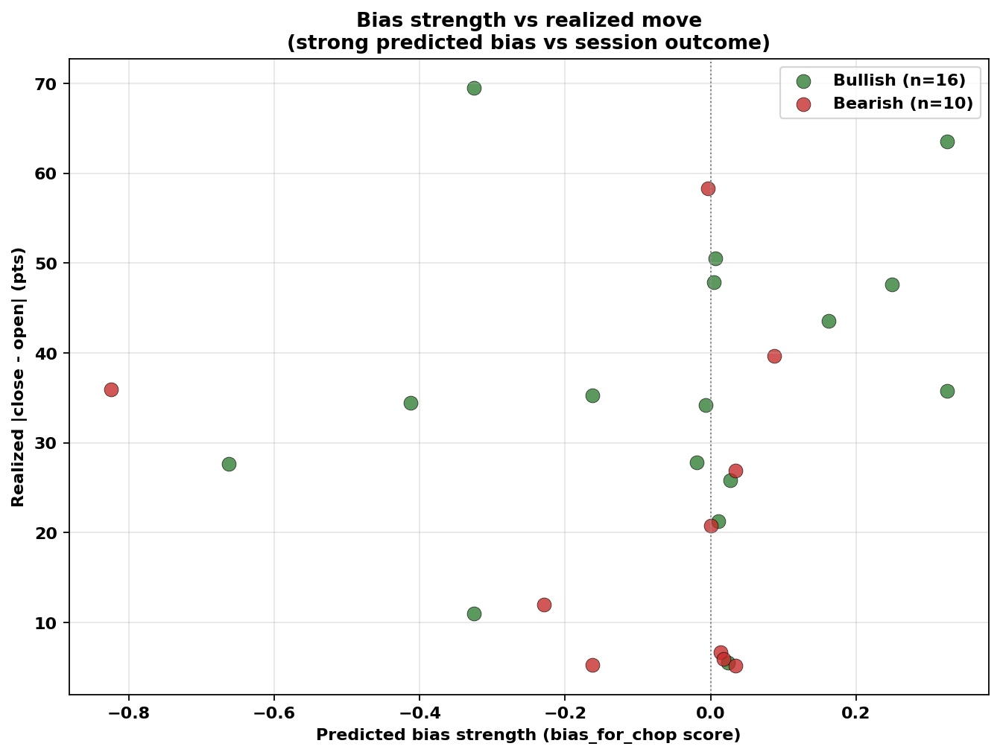
*Figure 5 — Bias strength vs realized session body. Stronger predicted bias tends to associate with larger directional body movement, but rotational sessions still create noise. This is exactly why strength is modeled separately from direction.*

### Four-stage session logic

Instead of forcing one label onto the full day, the framework divides RTH into four phases:

```text
09:30–11:00
11:00–12:30
12:30–14:00
14:00–16:00
```

Each stage has its own direction and strength model. Later stages can use earlier predicted structure as additional context.

```text
Stage 1 → base features
Stage 2 → base features + stage 1
Stage 3 → base features + mean(stage 1–2)
Stage 4 → base features + mean(stage 1–3)
```

This was one of the first points where the system started to look less like a static predictor and more like a sequential state model.

## Chop Regime Modeling

At some point during development, I realized that volatility itself was not the real problem.

The real problem was chop.

For a beginner trader, rotational sessions can be extremely dangerous. Price looks active, but continuation repeatedly fails. A trader may enter again and again, only to be caught inside the same range.

That observation led to one of the deepest modules in the project: the chop regime engine.

The core target became **chop duration**:

```text
share of RTH minutes covered by statistically flat windows
```

### Defining flat market structure

A 30-minute and 20-minute windows are classified as rotational only if several filters agree:

```text
compressed ATR-normalized range
        +
limited directional drift
        +
dense internal price distribution
        ↓
flat / chop window
```

Overlapping windows are merged by minute coverage.

The final target is:

```text
covered flat minutes / 390 RTH minutes
```

This target is more useful than a simple high-volatility / low-volatility label.

A session can be volatile and still rotational. Another session can have moderate volatility and still trend cleanly.

So the model tries to estimate something more practical:

> how tradable the session structure may actually be.

### Feature research

This module became one of the clearest examples of turning market intuition into measurable variables.

Examples of engineered signals include:
- `chop_ratio_gap`,
- `chop_duration_gap`,
- `pm_directional_eff`,
- `pm_vwap_stickiness`,
- `failed_breakout_gap`,
- `iv_rv_dislocation_gap`,
- `inside_cluster_gap`.

Each feature tries to answer a behavioral question:
- Is premarket directional or two-sided?
- Is realized volatility compressing?
- Are failed breakouts increasing?
- Is price repeatedly returning to VWAP?
- Is current structure unusual compared with recent sessions?

This is where the project started feeling less like a trading script and more like ML-oriented regime research.

<div align="center">
        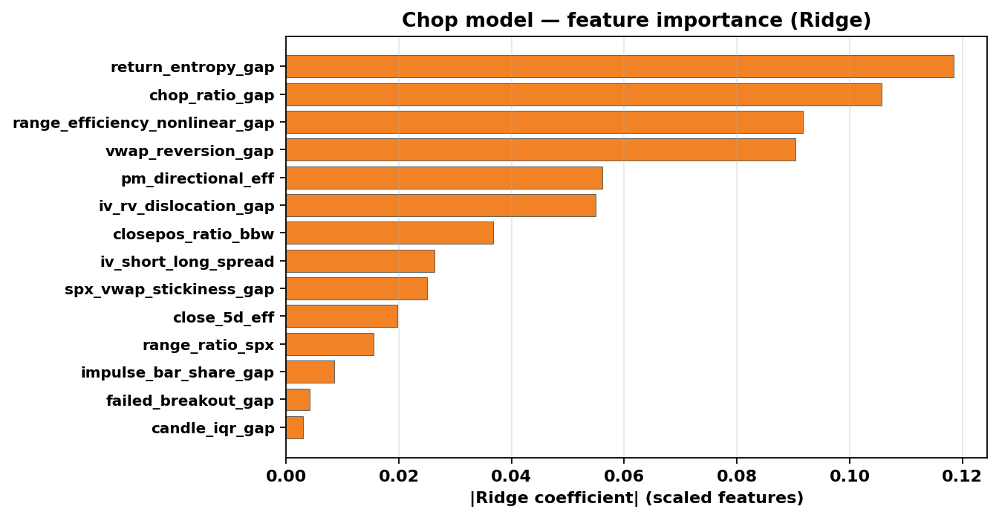
</div>

*Figure 6 — Chop model feature importance. The strongest predictors describe premarket rotational behavior: chop gaps, VWAP stickiness, failed-breakout structure, and IV/RV dislocation. Chop is treated as a structural regime variable, not just a volatility reading.*

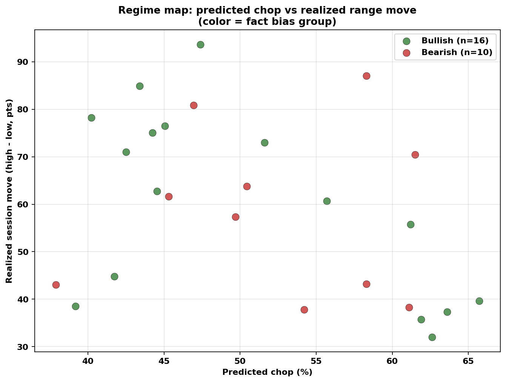
*Figure 7 — Regime map across backtest sessions. Predicted chop interacts with realized range and directional group, which is why chop and bias are modeled together before scenario construction.*

## Similarity Pool Engine

Once the framework could estimate bias, chop, and volatility structure, another idea became important.

Instead of trying to predict every target directly, I started asking:

> Which historical sessions does today resemble?

That led to the similarity pool engine.

In the codebase, this logic lives inside `chop.py`. It uses predicted regime information to build weighted pools of historical sessions.

The pool is based on:
- predicted chop,
- directional bias,
- premarket range,
- IV/RV dislocation,
- VWAP behavior,
- and recency weighting.

```text
Predicted regime
        ↓
weighted historical similarity search
        ↓
analog session pool
        ↓
scenario metrics
```

The similarity pool is then used to derive:
- expected move (high-low of scenario range),
- bullish and bearish targets,
- chop zones,
- candle sequence statistics,
- and scenario envelopes.

This became one of the most important conceptual shifts in the project.

The framework stopped asking only:

> What exact number will SPX print?

and started asking:

> What type of historical session does today look like?

That made the system more interpretable and more useful for building scenarios.

## Dynamic Support & Resistance Engine

Most support/resistance tools rely on pivot formulas, highs/lows, or manually drawn chart levels.

I wanted the levels module to be more behavior-driven.

The engine treats levels as:
- probabilistic reaction areas,
- volatility-adjusted acceptance zones,
- and recurring behavioral structures.

```text
Historical sessions
        ↓
flat-segment extraction
        ↓
adaptive clustering
        ↓
reaction statistics
        ↓
ranked behavioral zones
```

Instead of only searching for extrema, it looks for areas where price repeatedly showed:
- rotational acceptance,
- failed expansion,
- micro-balance,
- dense trading activity.

Each level stores interaction statistics such as bounce count, break frequency, ATR-normalized excursion, and historical strength.

Example internal level representation:

```json
{
  "price": 7522.45,
  "side": "support",
  "bounce_count": 2,
  "break_count": 2,
  "strength": 1.94
}
```

The main idea is simple:

> support and resistance should behave less like arbitrary chart lines and more like historically validated reaction regions.

## Trade Plan Generation

Once the forecasting layers were available, the next challenge was combining them into something a trader could actually use.

That became the Trade Plan engine.

The Trade Plan is not a single signal.

It is a structured execution map built from:
- opening forecast,
- bias structure,
- chop expectations,
- expected ranges,
- historical analog behavior,
- and support/resistance context.

```text
Forecasting layers
        ↓
regime interpretation
        ↓
scenario construction
        ↓
Trade Plan workbook
```

A generated Trade Plan contains:
- bullish and bearish scenarios,
- expected ranges,
- target ladders,
- support/resistance structure,
- risky chop zones,
- and intraday continuation conditions.

### Example Trade Plan workbook

The framework exports an Excel workbook — not one prediction, but a full execution map with both scenarios side by side.

<div align="center">
        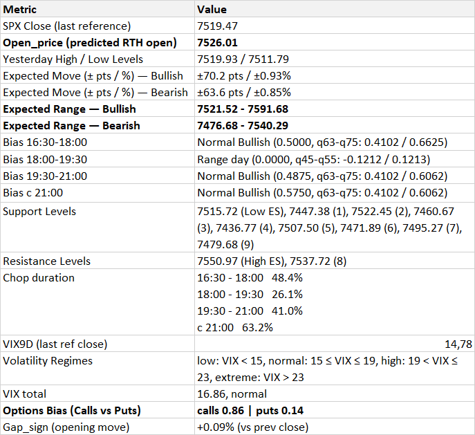
</div>

*Figure 8 — Summary view of a generated Trade Plan. The reader sees predicted open, directional bias label, chop percentage, expected move, and active scenario context.*

<div align="center">
        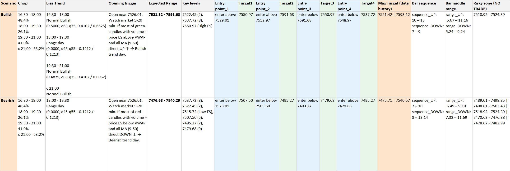
</div>

*Figure 9 — Full Trade Plan workbook. Each scenario row contains expected range, entry logic, target ladder, max target, key support/resistance levels, and sequence/range statistics derived from the similarity pool.*

One important design decision was preserving both bullish and bearish paths.

The framework does not pretend it knows the future with certainty. Instead, it prepares conditional scenarios and helps the trader understand which one is becoming active after the market opens.

### What the System Actually Produces

At this point the project stops being theoretical.

The framework generates structured session forecasts before the market opens.

Example output snapshot:

```json
{
  "open_pred": 7526.01,
  "expected_move_pts": 66.05,
  "predicted_chop_pct": 82.6,
  "bias_combined_4": 0.4875
}
```

Those values are then converted into practical execution structure:
- bullish and bearish ranges,
- target sequences,
- chop zones,
- key levels,
- and intraday continuation triggers.

Example generated levels:

```json
{
  "support_levels": [7495.27, 7507.49, 7515.72],
  "resistance_levels": [7537.72, 7550.97]
}
```

This is the point where the framework becomes useful as a trader-assistance tool. It does not remove uncertainty, but it gives the session a structure.

## Intraday Adaptive Recalibration

One of the most important ideas behind the project is:

> the morning forecast is temporary.

Once the market opens, the framework compares predicted structure with realized behavior.

As fresh 1-minute SPX data arrives, the system progressively replaces assumptions with live session information.

```text
Morning Trade Plan
        ↓
Fresh SPX data
        ↓
Session-state rebuild
        ↓
Bias / Chop recalibration
        ↓
Updated Trade Plan
```

This is especially important during:
- failed breakouts,
- volatility shocks,
- trend reversals,
- high-chop transitions.

Example intraday state snapshot:

```json
{
  "intraday_phase": "stage3",
  "predicted_chop_pct": 82.6,
  "active_is_bull": false
}
```

By stage 3, the framework had already shifted toward a high-chop interpretation and marked the bullish side as inactive.

That is exactly the type of behavior I wanted from the system: not stubborn prediction, but adaptive interpretation.

### Segment-aligned intraday updates

Intraday recalibration uses the **same four RTH segments** as the bias and chop engines:

```text
09:30–11:00
11:00–12:30
12:30–14:00
14:00–16:00
```

In practice, the trader does not refresh the plan continuously. After each completed segment, `update_TradePlan.py` rebuilds bias/chop context, similarity-pool weights, ranges, entries, and targets from fresh 1-minute SPX data.

Recommended workflow (NY time):

| When to run `manage.py update` | Completed segment | What the engine uses |
|---|---|---|
| **~11:00** | 09:30–11:00 | realized first-segment structure → staged bias/chop for segments 2–4 |
| **~12:30** | 09:30–12:30 | two segments of fact → next targets and active scenario |
| **~14:00** | 09:30–14:00 | three segments of fact → late-session recalibration |

So the first update happens **about 90 minutes after the open**; then two more sequential updates at **12:30** and **14:00**. Each pass produces `update_TradePlan_<date>.xlsx` with the same layout as the morning plan, but numbers and the active scenario row reflect what the market has already shown.

<div align="center">
        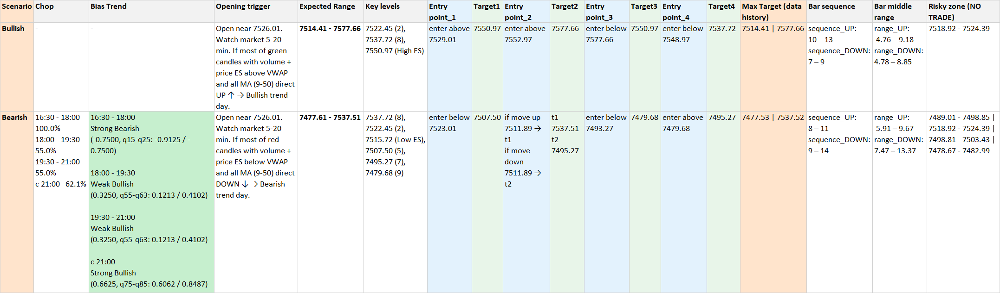
</div>

*Figure 10 — First intraday update (`update_1`). After the 09:30–11:00 segment, the workbook shows which scenario is gaining priority, refreshed chop context, and adjusted entries/targets for the remaining session. Compare with the morning `SPX_TradePlan` to see how early RTH behavior changed the plan.*

<div align="center">
        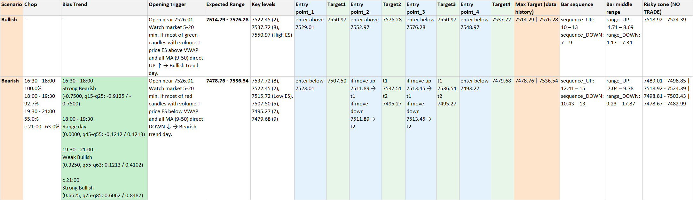
</div>

*Figure 11 — Second intraday update (`update_2`). After 09:30–12:30, the engine incorporates two completed segments: bias/chop stages advance, similarity-pool filtering tightens, and target ladders shift toward what is still realistic in the afternoon. This is the bridge between “morning hypothesis” and late-session execution.*

## Quantitative Validation

The current backtest should be interpreted carefully.

At the time of writing, the historical database contains **120 processed SPX sessions**, and the current rolling validation window covers **30 sessions until May 27, 2026**. 

This is not enough data for a final statistical verdict.

That is important to say clearly.

The goal of the current backtest is not to prove that the framework is a finished trading model. The goal is to check whether the system already produces meaningful market structure.

The validation focuses on:
- directional alignment,
- volatility regime calibration,
- expected move consistency,
- range containment,
- chop calibration,
- and scenario stability.

### Expected move and chop

<div align="center">
        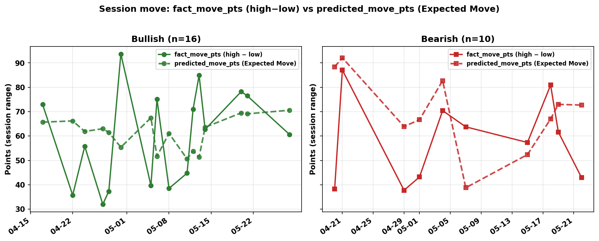
</div>

*Figure 12 — Expected Move vs realized session range. The model currently tends to overestimate movement during several volatile sessions, which suggests conservative move sizing.*

<div align="center">
        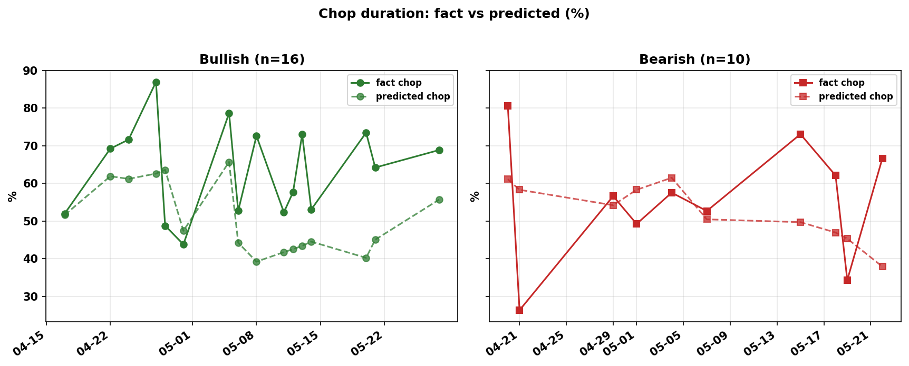
</div>

*Figure 13 — Chop duration validation. This checks whether the model correctly anticipated rotational session behavior.*

### Range, targets, and structural containment

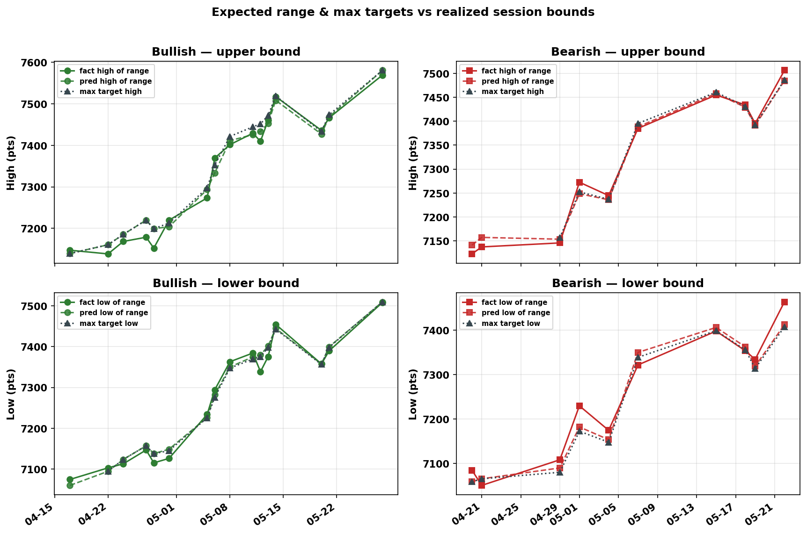

*Figure 14 — Expected range and max targets vs realized session bounds. This shows whether predicted envelopes and target ladders bracketed actual price behavior.*

<div align="center">
        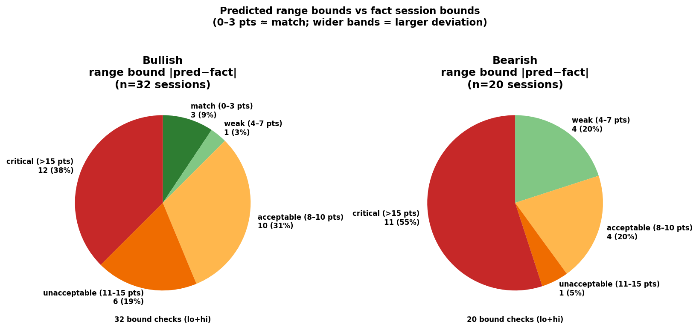
</div>

*Figure 15 — Range bound calibration tiers. This helps evaluate how close predicted range edges were to realized session extremes.*

### Move calibration and error structure

<div align="center">
        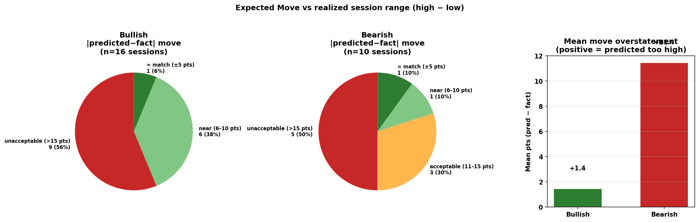
</div>

*Figure 16 — Expected Move calibration. Positive mean overstatement means the model predicted a larger range than realized.*

<div align="center">
        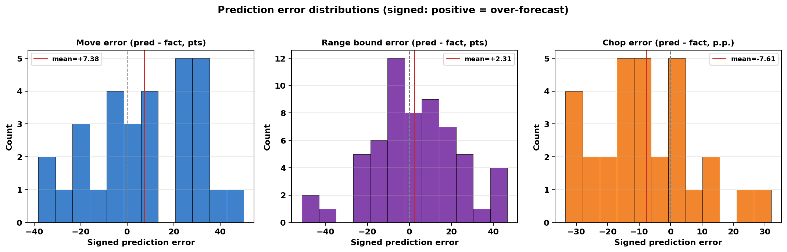
</div>

*Figure 17 — Signed prediction error distributions. Move and chop errors currently skew conservative, which is preferable to systematically understating risk at this stage.*

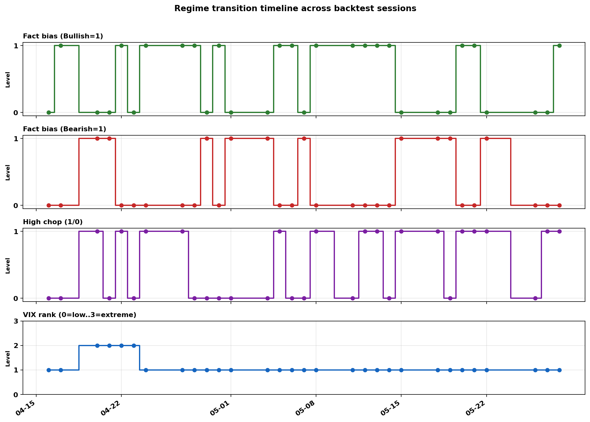 
*Figure 18 — Regime transition timeline. This shows how bias, chop, and volatility regimes changed across sessions — the same state variables the framework attempts to forecast each morning.*

## Interpretation

The backtest is easier to read if we separate **model metrics** from **trader-facing value**.

On the modeling side, the split is still clear:
- **stronger areas:** directional regime recognition, range/target envelope structure, VIX-rank context,
- **weaker areas:** full-session move magnitude (`predicted_move_pts` vs `fact_move_pts`) and late-session acceleration.

`Expected Move` still tends to overstate how far price may travel on some volatile days. That is a calibration issue, not the main story of the framework.

What matters more for execution is that the Trade Plan does **not** hand the trader a single session range and a distant maximum target. Instead, it builds a **chain of entries and targets** grounded in chop zones and key levels from `levels.py` and the similarity pool in `chop.py`. The morning workbook keeps **both** Bullish and Bearish scenarios side by side. After the open, the trader **does not choose or “activate” a scenario manually** — they watch how the market and the option structure behave in the first minutes of RTH and infer **which scenario has actually turned on** (Bullish or Bearish). Only then do they concentrate on that scenario’s entries, chop-risk zones, and target ladder.

The most important practical observation from the current 30-session window was not perfect Expected Move hit rate, but **target-ladder behavior on the scenario that ended up active:**
- **Target 1 and Target 2 were reached on nearly every session** once the **activated** scenario (Bullish or Bearish, as realized in RTH) was in play.
- That gives the trader two structurally defined, more conservative trades at the start of the day.
- **Target 3, Max Target, and full Expected Move** were reached less often — which matches the conservative move sizing seen in Figures 12 and 16.

<div align="center">
        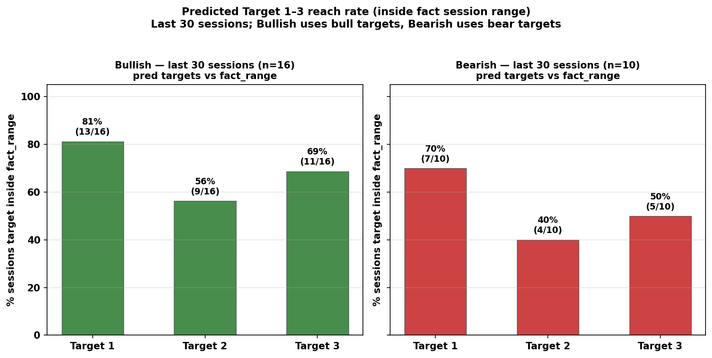
</div>

*Figure 19 — Target reach validation (last 30 sessions). For each fact-bias group, predicted Target 1–3 from the matching scenario row (bull or bear) are compared to realized `fact_range` (session low–high). A target counts as reached when its price lies inside that range. Bar height is the share of sessions where the target was reached; labels show percent and (hits / evaluable sessions). Bullish and Bearish panels are shown separately.*

So the framework already behaves like a **decision-support ladder**, not a “predict the high of the day” tool. After Targets 1–2, the trader can slow down and align the next decision with the segment updates at **11:00, 12:30, and 14:00** (Figures 18–19): whether chop is expanding, whether the **activated** scenario still fits price action, and whether a third entry still matches the refreshed plan.

For a young ML project on ~120 historical sessions, that is a meaningful result: imperfect amplitude forecasting, but **repeatable structure** around direction, safer entries, and achievable near targets.

### Why the Project Still Uses Ridge Regression

A natural question is:

> Why not use deep learning, transformers, or reinforcement learning already?

The answer is simple:

> the dataset is still small.

With 120 processed sessions, avoiding overfitting is more important than maximizing model complexity.

During experimentation, more complex models often behaved exactly as small-data ML systems usually behave:
- they looked promising during training,
- but became unstable on unseen sessions.

Surprisingly, simpler Ridge-based models generalized more consistently.

That changed my perspective on the project.

Instead of focusing on complexity, I started focusing on:
- target quality,
- feature engineering,
- calibration stability,
- sequential logic,
- and interpretability.

The current framework therefore prioritizes:
- interpretable regression,
- iterative feature pruning,
- robust statistics,
- and reproducible behavior.

This is not a limitation of the project. It is the foundation stage.

As the database grows, the same architecture can later support:
- non-linear ensemble models,
- probabilistic scenario ranking,
- sequential learning,
- and more advanced adaptive forecasting techniques.

```text
robust statistical foundation
        +
modular architecture
        +
expanding historical database
        ↓
future non-linear evolution
```

## Pipeline Orchestration & Automation

As the project grew, orchestration became almost as important as forecasting.

The framework evolved into a deterministic pipeline coordinated through `manage.py`.

```text
manage.py
      ↓
dependency validation
      ↓
spx_data_loader → open_price → bias → chop → levels → build_TradePlan
      ↓
SPX_TradePlan_<date>.xlsx

update mode:
fresh_data_loader → update_TradePlan → update_TradePlan_<date>.xlsx
```

The orchestrator controls:
- market data synchronization,
- dependency validation,
- model execution order,
- centralized logging,
- and intraday rebuild workflows.

The project supports three operational modes:

| Mode | Purpose |
|---|---|
| `daily` | premarket forecast generation |
| `full` | historical rebuild and recalibration |
| `update` | live intraday adaptive rebuilding |

This part of the project may look less exciting than the models, but it matters for reproducibility. A research framework is much more useful when old forecasts can be regenerated, checked, and improved.

### Docker deployment

For reproducible execution outside the development environment, the project is also packaged as a Docker image.

The container bundles the Python pipeline, model artifacts, compressed feature tables, and a baseline historical `data_spx` snapshot.

This keeps research logic and execution aligned: the same commands used locally can be run in a portable environment.

### What I Learned Building This

The biggest lesson was that modeling financial markets is not only about choosing an algorithm.

For this project, the more important work was:
- defining the right targets,
- building features without leakage,
- separating direction from tradability,
- modeling chop as its own regime,
- and connecting model outputs into a usable decision workflow.

As a beginner ML researcher, this project helped me understand how important logical decomposition is.

A complex trading day became a chain of smaller questions:
- Where may the session open?
- Is the early structure directional?
- Is the environment likely to chop?
- Which historical sessions look similar?
- Where are realistic targets?
- Which scenario is becoming active?
- Should the plan be recalibrated intraday?

That chain of questions became the architecture.

And this is why the project is not only about ML-trading. It is also about the ability to think systematically, transform intuition into measurable variables, and build a working research pipeline around uncertainty.

## Future Development

Several next steps are planned:
- expand the historical SPX session database,
- improve Expected Move calibration,
- refine chop and similarity-pool modeling,
- introduce probabilistic scenario scoring,
- enhance validation infrastructure,
- and evaluate more advanced models as the dataset grows.

The objective is not to redesign the framework, but to continue improving its accuracy, robustness, and practical value as a decision-support tool for intraday SPX trading.

## Conclusion

TradePlan_SPX started as a small personal experiment.

I wanted to understand whether my ML and engineering knowledge could help structure a trading problem that initially looked chaotic.

Over time, the project became much broader than I expected.

It turned into an adaptive market-state framework focused on interpreting how SPX sessions behave rather than simply predicting whether price will go up or down.

The most important lesson was that markets cannot be reduced to a single prediction.

Direction alone is insufficient.

Volatility alone is insufficient.

Even a correct forecast can be useless if the system cannot distinguish:
- trend from rotation,
- continuation from failure,
- stable structure from unstable expansion.

That realization shaped the entire architecture.

Most importantly, the project has already shown that the idea is not empty.

Even with a relatively small historical database, the framework has started producing meaningful structural forecasts and adaptive session interpretation. It is not perfect, and it is not finished, but it has already begun to serve its original purpose: helping transform intraday uncertainty into a structured Trade Plan.

For me, that is the strongest result at this stage.

The project now has a functioning architecture, early validation signals, and a clear optimization path.

The next stage is not proving that the idea exists.

The next stage is improving it.
